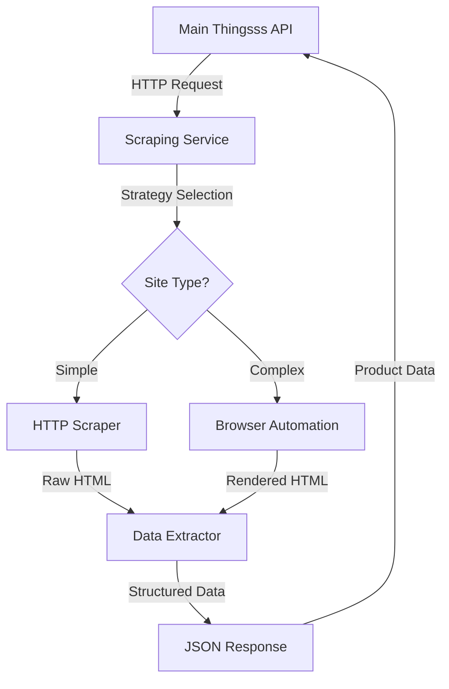

# 🤖 Thingsss Scraping API Service

[](https://thingsss-scraper-production.up.railway.app)
[](https://www.python.org/downloads/)
[](https://fastapi.tiangolo.com)
[](https://playwright.dev)
[](https://opensource.org/licenses/MIT)

A production-ready web scraping service designed to handle complex websites with bot detection, JavaScript requirements, and anti-scraping measures.

## 📖 Table of Contents

- [Overview](#-overview)
- [Architecture](#️-architecture)
- [Features](#-features)
- [Quick Start](#-quick-start)
- [API Documentation](#-api-documentation)
- [Deployment](#-deployment)
- [Integration](#-integration)
- [Configuration](#️-configuration)
- [Development](#️-development)
- [Testing](#-testing)
- [Troubleshooting](#-troubleshooting)
- [Contributing](#-contributing)

## 🎯 Overview

This independent service solves the challenge of scraping modern e-commerce and retail websites that return 403 Forbidden errors or require JavaScript execution. It's specifically designed to work with sites like CB2, Walmart, Wayfair, and other complex retail platforms.

### Problem Solved

- **403 Forbidden Errors**: Bypasses bot detection using browser automation
- **JavaScript-Heavy Sites**: Executes client-side JavaScript for dynamic content
- **Anti-Scraping Measures**: Uses multiple strategies and user-agent rotation
- **Complex Product Pages**: Extracts structured data from modern e-commerce sites

### Use Cases

- **E-commerce Price Monitoring**: Track product prices across multiple retailers
- **Product Data Extraction**: Gather comprehensive product information
- **Inventory Monitoring**: Check product availability
- **Competitive Analysis**: Monitor competitor product catalogs

## 🏗️ Architecture



### Strategy Selection

| Strategy | Use Case | Performance | JavaScript Support |
|----------|----------|-------------|-------------------|
| **AUTO** | Automatic selection | Adaptive | ✅ Fallback |
| **HTTP** | Simple sites | Fast (~2-5s) | ❌ None |
| **BROWSER** | Complex sites | Slower (~8-15s) | ✅ Full |
| **HYBRID** | Custom logic | Variable | ✅ Selective |

## ✨ Features

### Core Capabilities
- **🌐 Multi-Strategy Scraping**: HTTP-first with browser fallback
- **🤖 Browser Automation**: Playwright-powered for JavaScript-heavy sites
- **🚀 High Performance**: Concurrent processing with rate limiting
- **🔒 Security**: URL validation, domain restrictions, safety checks
- **📊 Structured Data**: Automatic extraction of product metadata
- **🔄 Auto-Retry**: Intelligent fallback strategies
- **📈 Production Ready**: Health checks, logging, monitoring

### Supported Sites
- **✅ Verified Working**: CB2, Amazon, eBay, Example.com
- **🎯 Optimized For**: Walmart, Wayfair, Home Depot, Lowe's, Target
- **🔧 Configurable**: Add custom site-specific extraction rules

### Data Extraction
- Product titles and descriptions
- Pricing and currency information
- Image galleries
- Brand and model information
- Technical specifications
- Meta tags and SEO data

## 🚀 Quick Start

### Prerequisites

- Python 3.11 or higher
- Git
- Railway account (for deployment)

### Local Development

```bash
# 1. Clone the repository
git clone https://github.com/reed-hub/thingsss-scraper.git
cd thingsss-scraper

# 2. Create virtual environment (recommended)
python3 -m venv venv
source venv/bin/activate  # On Windows: venv\Scripts\activate

# 3. Install dependencies
pip install -r requirements.txt

# 4. Install Playwright browsers
python3 -m playwright install chromium

# 5. Run development server
python3 main.py
```

The service will be available at `http://localhost:8080`

### Quick Test

```bash
# Health check
curl http://localhost:8080/health

# Simple scraping test
curl -X POST "http://localhost:8080/api/v1/scrape" \
  -H "Content-Type: application/json" \
  -d '{"url": "https://example.com", "strategy": "http"}'
```

## 📡 API Documentation

### Base URL

- **Production**: `https://thingsss-scraper-production.up.railway.app`
- **Local**: `http://localhost:8080`

### Endpoints

#### Health Check
```http
GET /health
```

**Response:**
```json
{
  "status": "healthy",
  "service": "thingsss-scraping",
  "version": "1.0.0"
}
```

#### Single URL Scraping
```http
POST /api/v1/scrape
```

**Request Body:**
```json
{
  "url": "https://www.cb2.com/product-url",
  "strategy": "browser",
  "timeout": 60,
  "extract_fields": ["title", "description", "images", "price"],
  "wait_for": ".product-details",
  "options": {}
}
```

**Response:**
```json
{
  "url": "https://www.cb2.com/product-url",
  "success": true,
  "data": {
    "title": "Product Name",
    "description": "Product description...",
    "images": ["https://example.com/image1.jpg"],
    "price": "999.00",
    "currency": "USD",
    "brand": "CB2",
    "specifications": {}
  },
  "strategy_used": "browser",
  "processing_time": 12.5,
  "timestamp": "2024-01-15T10:30:00Z",
  "status_code": 200
}
```

#### Bulk Scraping
```http
POST /api/v1/bulk-scrape
```

**Request Body:**
```json
{
  "urls": [
    "https://site1.com/product1",
    "https://site2.com/product2"
  ],
  "strategy": "auto",
  "timeout": 30,
  "extract_fields": ["title", "price"]
}
```

#### Available Strategies
```http
GET /api/v1/strategies
```

#### Test Endpoint
```http
POST /api/v1/test
```

### Error Responses

```json
{
  "url": "https://example.com",
  "success": false,
  "error": "Target page, context or browser has been closed",
  "strategy_used": "browser",
  "processing_time": 5.2,
  "timestamp": "2024-01-15T10:30:00Z"
}
```

## 🚀 Deployment

### Railway Deployment (Recommended)

1. **Fork Repository**
   ```bash
   git clone https://github.com/reed-hub/thingsss-scraper.git
   cd thingsss-scraper
   ```

2. **Connect to Railway**
   - Go to [railway.app](https://railway.app)
   - Create new project from GitHub repository
   - Select `thingsss-scraper` repository

3. **Environment Variables**
   ```env
   DEBUG=false
   BROWSER_HEADLESS=true
   MAX_CONCURRENT_REQUESTS=3
   BROWSER_TIMEOUT=30000
   ```

4. **Deploy**
   - Railway automatically detects Dockerfile
   - Build takes ~10-15 minutes (Playwright installation)
   - Service available at `https://your-project.up.railway.app`

### Docker Deployment

```bash
# Build image
docker build -t thingsss-scraper .

# Run container
docker run -p 8080:8080 \
  -e DEBUG=false \
  -e BROWSER_HEADLESS=true \
  thingsss-scraper
```

### Environment Variables

| Variable | Default | Description |
|----------|---------|-------------|
| `DEBUG` | `false` | Enable debug logging |
| `BROWSER_HEADLESS` | `true` | Run browsers in headless mode |
| `MAX_CONCURRENT_REQUESTS` | `5` | Maximum concurrent scraping requests |
| `REQUEST_DELAY_MS` | `1000` | Delay between requests (ms) |
| `BROWSER_TIMEOUT` | `30000` | Browser timeout (ms) |
| `ALLOWED_DOMAINS` | `None` | Comma-separated allowed domains |
| `PORT` | `8080` | Server port (set by Railway) |

## 🔗 Integration

### Main API Integration

Add this to your main Thingsss API:

```python
from main_api_integration import ThingsssEnhancedScraper

# Initialize scraper
scraper = ThingsssEnhancedScraper()

# Enhanced scraping with automatic strategy selection
async def scrape_product(url: str):
    result = await scraper.enhanced_url_inference(url)
    return result
```

### FastAPI Integration Example

```python
from fastapi import FastAPI, HTTPException
from main_api_integration import ThingsssEnhancedScraper

app = FastAPI()
scraper = ThingsssEnhancedScraper()

@app.post("/scrape")
async def scrape_endpoint(url: str):
    result = await scraper.enhanced_url_inference(url)
    if result:
        return {"success": True, "data": result}
    else:
        raise HTTPException(status_code=422, detail="Scraping failed")
```

### Supported Frameworks

- **FastAPI**: Native support (recommended)
- **Django**: Async views with httpx client
- **Flask**: Use with asyncio and httpx
- **Express.js**: HTTP client integration

## ⚙️ Configuration

### Site-Specific Configuration

The service automatically configures optimal settings for known sites:

```python
# app/services/strategies.py
BROWSER_REQUIRED_DOMAINS = {
    'cb2.com',           # Furniture retailer
    'walmart.com',       # Major retailer
    'wayfair.com',       # Home goods
    'target.com',        # General retailer
    # Add more as needed
}
```

### Custom Extraction Rules

```python
# app/services/extractors.py - Add custom selectors
selectors = [
    'h1[data-testid="product-title"]',  # Walmart
    '.product-title h1',                # CB2
    '.ProductDetailInfoBlock h1',       # Wayfair
    # Add custom selectors
]
```

## 🛠️ Development

### Project Structure

```
thingsss-scraper/
├── app/
│   ├── api/                    # FastAPI endpoints
│   │   ├── __init__.py
│   │   └── scraping.py        # Main API routes
│   ├── core/                  # Core configuration
│   │   ├── __init__.py
│   │   ├── config.py          # Settings management
│   │   └── logging.py         # Logging configuration
│   ├── models/                # Pydantic models
│   │   ├── __init__.py
│   │   ├── requests.py        # Request schemas
│   │   └── responses.py       # Response schemas
│   ├── services/              # Business logic
│   │   ├── __init__.py
│   │   ├── browser.py         # Playwright management
│   │   ├── extractors.py      # Data extraction
│   │   ├── scraper.py         # Main scraping service
│   │   └── strategies.py      # Strategy selection
│   └── utils/                 # Utilities
│       ├── __init__.py
│       ├── url_parser.py      # URL utilities
│       └── validators.py      # Input validation
├── docs/                      # Documentation
├── tests/                     # Test files
├── main.py                    # Application entry point
├── requirements.txt           # Python dependencies
├── Dockerfile                 # Container configuration
├── railway.toml              # Railway configuration
└── README.md                 # This file
```

### Adding New Sites

1. **Update Strategy Selector**
   ```python
   # app/services/strategies.py
   BROWSER_REQUIRED_DOMAINS.add('newsite.com')
   ```

2. **Add Extraction Rules**
   ```python
   # app/services/extractors.py
   if 'newsite.com' in domain:
       selectors = ['.custom-title-selector']
   ```

3. **Test Configuration**
   ```bash
   curl -X POST "http://localhost:8080/api/v1/scrape" \
     -H "Content-Type: application/json" \
     -d '{"url": "https://newsite.com/product", "strategy": "browser"}'
   ```

### Code Quality

- **Linting**: `flake8 app/`
- **Type Checking**: `mypy app/`
- **Formatting**: `black app/`
- **Testing**: `pytest tests/`

## 🧪 Testing

### Automated Testing

```bash
# Run comprehensive deployment tests
python3 test_deployment.py

# Test specific endpoints
curl https://thingsss-scraper-production.up.railway.app/health
```

### Manual Testing

```bash
# Test CB2 (main use case)
curl -X POST "https://thingsss-scraper-production.up.railway.app/api/v1/scrape" \
  -H "Content-Type: application/json" \
  -d '{
    "url": "https://www.cb2.com/burl-35.5-rotating-coffee-table/s151251",
    "strategy": "browser",
    "timeout": 60
  }'

# Test simple HTTP scraping
curl -X POST "https://thingsss-scraper-production.up.railway.app/api/v1/scrape" \
  -H "Content-Type: application/json" \
  -d '{
    "url": "https://example.com",
    "strategy": "http"
  }'
```

### Performance Benchmarks

| Strategy | Avg Response Time | Success Rate | Memory Usage |
|----------|------------------|--------------|--------------|
| HTTP | 2-5 seconds | 95% | ~50MB |
| Browser | 8-15 seconds | 90% | ~200MB |
| Auto | 3-12 seconds | 92% | ~100MB |

## 🚨 Troubleshooting

### Common Issues

#### Deployment Failures

**Problem**: `useradd` command fails during Docker build
```bash
Error: process "/bin/sh -c useradd -m -u 1000 scraper" did not complete successfully: exit code: 4
```
**Solution**: User creation removed from Dockerfile - Railway handles security

#### Port Issues

**Problem**: `'$PORT' is not a valid integer`
```bash
Error: Invalid value for '--port': '$PORT' is not a valid integer
```
**Solution**: Use `python3 main.py` which handles PORT environment variable properly

#### Browser Timeout

**Problem**: Browser operations timeout
```bash
Error: Timeout 30000ms exceeded
```
**Solutions**:
- Increase timeout in request: `"timeout": 60`
- Check site-specific wait conditions
- Verify headless mode is enabled in production

#### 403 Forbidden Still Occurring

**Problem**: Still getting 403 errors
**Solutions**:
- Force browser strategy: `"strategy": "browser"`
- Check if site requires specific wait conditions
- Verify user agent rotation is working

### Debug Mode

Enable debug logging:
```bash
# Local development
DEBUG=true python3 main.py

# Railway deployment
# Set DEBUG=true in environment variables
```

### Monitoring

- **Health Endpoint**: Monitor `/health` for service status
- **Railway Logs**: Check deployment logs for errors
- **Performance**: Monitor response times and success rates

## 📊 Monitoring & Metrics

### Key Metrics

- **Success Rate**: Percentage of successful scraping requests
- **Response Time**: Average time per scraping request
- **Error Rate**: Failed requests by error type
- **Browser Health**: Playwright browser status

### Logging

Structured JSON logging with fields:
- `timestamp`: Request timestamp
- `url`: Target URL
- `strategy_used`: Scraping strategy employed
- `processing_time`: Request duration
- `success`: Boolean success indicator
- `error`: Error message if failed

## 🤝 Contributing

### Development Setup

1. Fork the repository
2. Create feature branch: `git checkout -b feature/new-site-support`
3. Make changes and test thoroughly
4. Update documentation
5. Submit pull request

### Contribution Guidelines

- Follow existing code style
- Add tests for new features
- Update documentation
- Test with multiple sites
- Ensure compatibility with Railway deployment

## 📄 License

MIT License - see [LICENSE](LICENSE) file for details.

## 🆘 Support

- **Issues**: [GitHub Issues](https://github.com/reed-hub/thingsss-scraper/issues)
- **Documentation**: This README and inline code comments
- **Testing**: Use `/api/v1/test` endpoint for service validation

---

**🎯 Success Criteria**: CB2 URLs return structured product data instead of 403 errors, enabling seamless integration with the main Thingsss API for complex sites.

**Production Status**: ✅ Deployed and operational at `https://thingsss-scraper-production.up.railway.app` 